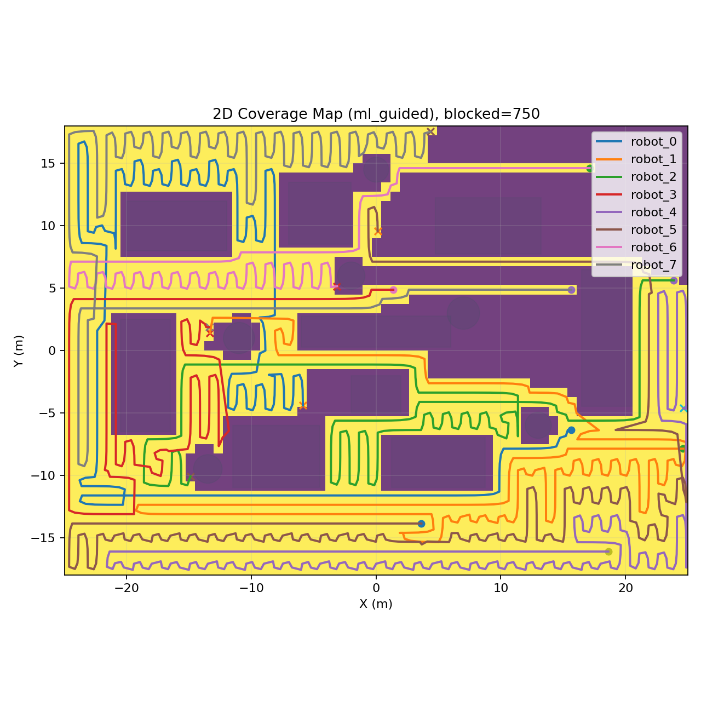
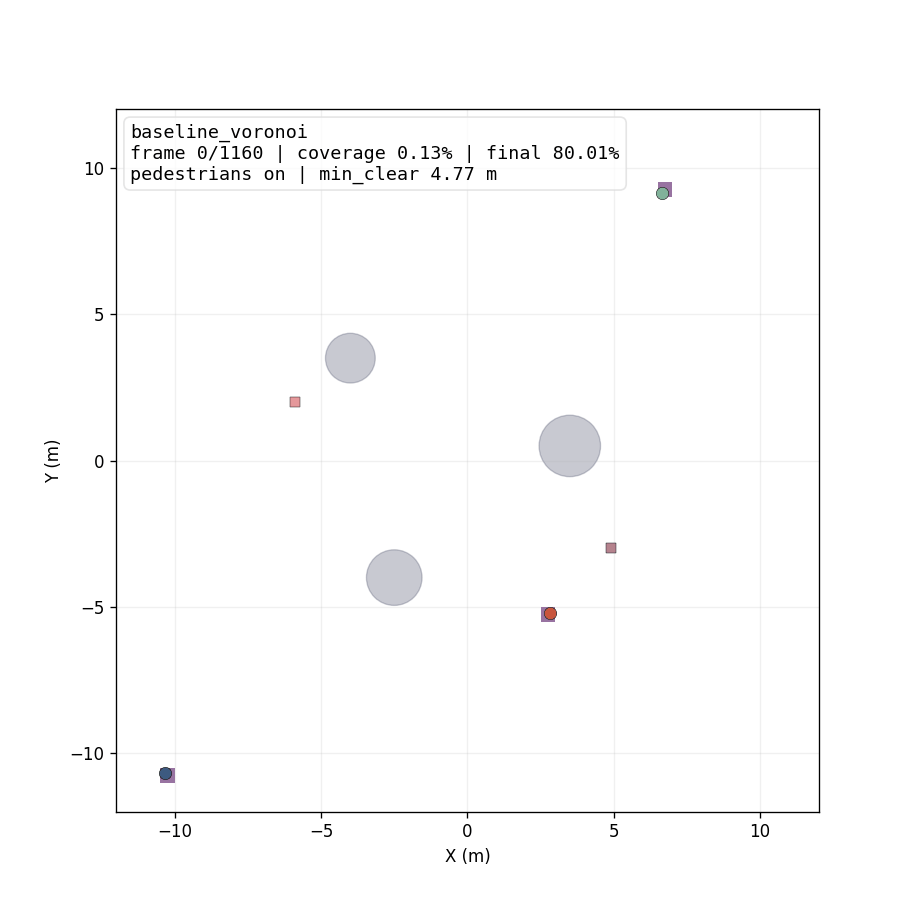
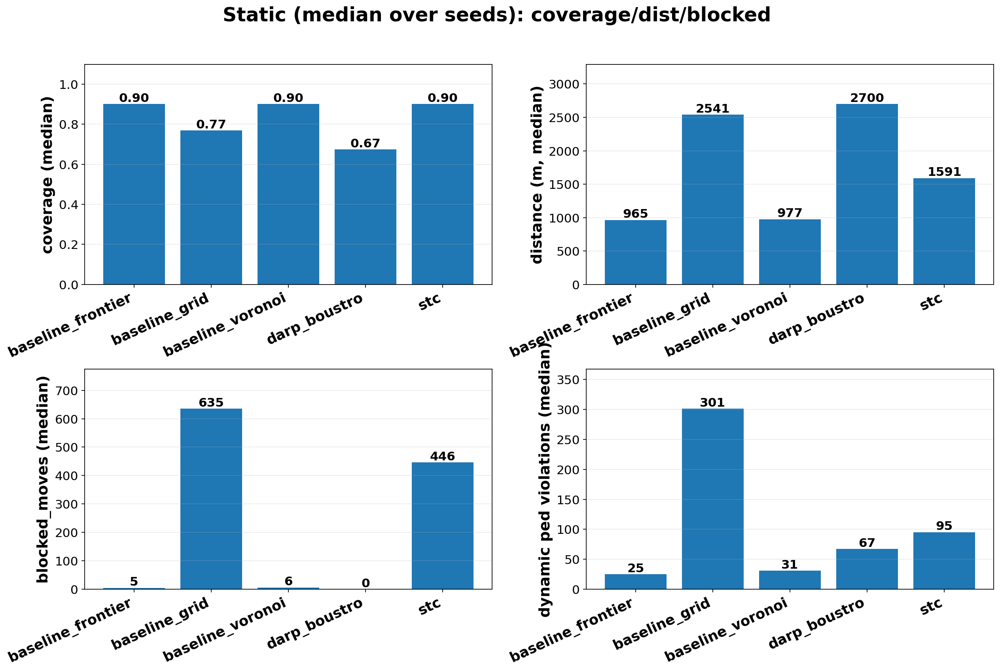
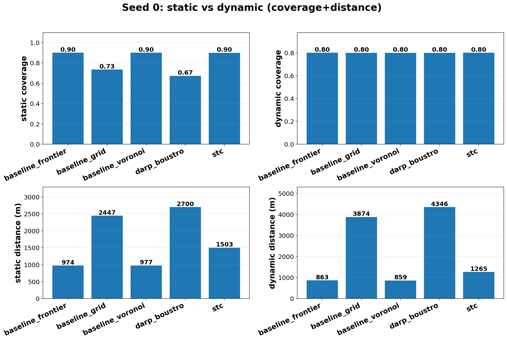

<div align="center">

# Multi-Robot Coverage Research

**Единый симуляционный стенд и воспроизводимые эксперименты для
многоагентного покрытия (multi-robot coverage path planning) —
от классических baseline до MAPF-deconfliction, RL и ML-guided
гибридов, на статических и динамических сценах.**

[](https://www.python.org/)
[](#)
[](#)

<br />



<sub><em>Прогон <code>ml_guided</code>, 8 роботов на сцене <code>large_complex_dynamic</code>:
каждый робот ведёт свою траекторию, обходит свою зону, общее покрытие
заполняет всё свободное пространство без столкновений со статикой
и между собой.</em></sub>

</div>

---

## Главное

- **Единая 2D-постановка** (`coverage_lab`) с общим JSON-контрактом
  результата для всех алгоритмов: покрытие, дистанция, баланс нагрузки,
  блокировки и метрики safety по пешеходам.
- **Batch-оркестратор экспериментов** (`experiments_lab`) — все публичные
  сравнения запускаются одной командой по YAML-конфигурациям.
- **Пять семейств алгоритмов** в одном стенде: классические baseline,
  структурные CPP (STC, DARP), MAPF/CBS-обёртки де-конфликта, PPO
  reinforcement learning и ML-guided / goal-guided гибриды с safety
  guardrail.
- **Статические и динамические сцены**, включая `large_complex_dynamic`
  с движущимися пешеходами для анализа блокировок и безопасности.
- **Опциональный 3D-replay** любого прогона в NVIDIA Isaac Sim.

---

## Как это выглядит

### Траектории — `baseline_voronoi`, динамическая сцена с пешеходами

<p align="center">
  
</p>

<sub><em>Три робота разбивают рабочее пространство на зоны Вороного и
обходят свою зону, пока по сцене движутся пешеходы. На HUD — текущее
покрытие, номер кадра и минимальный зазор робот–пешеход.</em></sub>

### 3D-replay в Isaac Sim — `ml_guided_guarded`, seed 2

<p align="center">
  
</p>

<sub><em>Тот же JSON-лог прогона переигран в Isaac Sim 5: согласованные
с 2D-экспериментом препятствия, пешеходы и позиции роботов. Полезно для
демо и проверки геометрической согласованности; в метрики основного
сравнения 3D-replay не входит.</em></sub>

### Бенчмарк-панели — публичное сравнение пяти алгоритмов

<p align="center">
  <br />
  <sub><strong>Static</strong> (медианы по seed): coverage / distance / blocked moves</sub>
</p>

<p align="center">
  <br />
  <sub><strong>Dynamic</strong> (медианы по seed): coverage / distance / blocked / ped violations</sub>
</p>

<p align="center">
  <br />
  <sub><strong>Seed 0</strong>: покрытие и дистанция рядом для одной и той же сцены в статике и динамике</sub>
</p>

### Сводные числа

Медианы по seed, `presentation_static` / `presentation_dynamic`:

| Алгоритм | static cov | dynamic cov | static dist (м) | dynamic dist (м) | ped viol (dyn) |
|---|---:|---:|---:|---:|---:|
| `baseline_frontier` | **0.90** | 0.80 | **965** | **852** | 25 |
| `baseline_voronoi`  | 0.90 | 0.80 | 977 | 860 | 31 |
| `stc`               | 0.90 | 0.80 | 1591 | 1265 | 95 |
| `baseline_grid`     | 0.77 | 0.80 | 2541 | 2907 | 301 |
| `darp_boustro`      | 0.67 | 0.80 | 2700 | 4296 | 67 |

Frontier и Voronoi доминируют по «цене покрытия», STC систематичен
но платит блокировками, DARP выигрывает по `load_balance_cv`
(в таблице не показано).

Полный отчёт: [`results/lab/presentation_report/report_cards.md`](results/lab/presentation_report/report_cards.md).
Индекс GIF: [`results/lab/presentation_report/GIF_INDEX.md`](results/lab/presentation_report/GIF_INDEX.md).

---

## Структура репозитория

```
multi_robot_coverage/
├── coverage_lab/          # ядро: симулятор, алгоритмы, RL, ML-guided
│   ├── algorithms/        # baselines, STC, DARP, MAPF-обёртки (CBS)
│   ├── ml_planner/        # ML-guided / goal-guided + guardrail
│   ├── rl/                # PPO-среда и policy
│   ├── env/  sim.py       # дискретный 2D-симулятор
│   └── metrics.py         # JSON-контракт результата и метрики
├── experiments_lab/       # batch-оркестратор, YAML-конфиги, обучение
│   ├── batch_*.yaml       # публичные матрицы сравнения
│   ├── scenes/            # static_A_long, dynamic_B_long, large_complex_*
│   ├── run_batch.py       # точка входа
│   ├── train_ppo.py       # обучение RL
│   └── train_ml_guided.py # обучение ML-guided
├── tests/                 # unit- и smoke-тесты
├── scripts/               # сборка отчётов, панели, утилиты
├── results/lab/           # артефакты прогонов (PNG, GIF, JSON, summary.csv)
└── coverage_sim/ + experiments/   # legacy Isaac Sim-трек (опционально)
```

Объём кода платформы: **~3.7 тыс. строк Python** (`coverage_lab` ~2.9 тыс.,
`experiments_lab` ~0.8 тыс.), плюс ~0.7 тыс. строк тестов.

---

## Быстрый старт

```bash
python -m venv .venv
.venv\Scripts\activate           # Windows
# source .venv/bin/activate      # Linux/macOS
pip install -r requirements.txt
```

Для RL дополнительно нужны `torch`, `gymnasium`, `stable-baselines3`
(см. `requirements-rl.txt`).

Smoke-тест — проверяет весь pipeline меньше чем за минуту:

```bash
python -m experiments_lab.run_batch --config experiments_lab/batch_plan_verify_smoke.yaml
python -m experiments_lab.run_batch --config experiments_lab/batch_plan_verify_dynamic_smoke.yaml
```

---

## Воспроизведение основных сравнений

Каждый `batch_presentation_*.yaml` пишет JSON по прогону, опциональные
PNG/GIF и `summary.csv` в `results/lab/<run_name>/`.

### Статическая сцена

```bash
python -m experiments_lab.run_batch --config experiments_lab/batch_presentation_static.yaml
```

### Динамическая сцена (с пешеходами)

```bash
python -m experiments_lab.run_batch --config experiments_lab/batch_presentation_dynamic.yaml
```

### Динамика + RL (PPO)

```bash
python experiments_lab/train_ppo.py --mode smoke --scene experiments_lab/scenes/dynamic_B_long.yaml
python -m experiments_lab.run_batch --config experiments_lab/batch_presentation_dynamic_rl.yaml
```

### Динамика + RL + ML-guided

```bash
python -m experiments_lab.run_batch --config experiments_lab/batch_presentation_dynamic_ml_rl.yaml
```

### Пересобрать публичный отчёт

```bash
python scripts/build_presentation_report.py --seed 0
```

Артефакты пишутся в `results/lab/presentation_report/` (медианные панели,
панели seed-0, `report_cards.md`, `GIF_INDEX.md`). Флаг `--render` у
`run_batch` дополнительно рисует GIF на каждый прогон.

---

## Семейства алгоритмов

| Семейство | Идентификаторы | Идея |
|---|---|---|
| Классические baseline | `baseline_grid`, `baseline_voronoi`, `baseline_frontier`, `baseline_random_walk` | жадный обход / разбиение / frontier / sanity-check |
| Структурные CPP | `stc`, `darp_boustro`, `darp_stc` | spanning-tree coverage и DARP-разбиение зон |
| MAPF-деконфликт | `cbs_*` | coverage задаёт намерения; `CBSDeconflictWrapper` решает конфликты на коротком горизонте |
| Reinforcement Learning | `ppo_policy` | PPO в среде `CoveragePedEnv` |
| ML-guided / Goal-guided | `ml_guided`, `ml_guided_guarded`, `ml_goal_*` | `SmallCNN` над локальным окном + safety guardrail |

Guardrail-индикатор `alpha_t ∈ {0, 1}` оставляет классический fallback,
когда ML-действие небезопасно или непродуктивно — это позволяет гибридам
работать в динамической сцене без всплеска `robot_ped_violations`.

---

## Контракт результата и метрики

Каждый прогон даёт JSON одной и той же схемы, поэтому конфигурации
сравнимы между семействами. Ключевые скаляры:

| Поле | Смысл | «Лучше» |
|------|-------|---------|
| `coverage_percent` | доля посещённых свободных ячеек | выше |
| `time_to_coverage_sec` | время до достижения `target_coverage` | ниже |
| `distance_travelled_m` | суммарная дистанция роботов | ниже |
| `efficiency` | покрытие на единицу дистанции | выше |
| `load_balance_cv` | коэффициент вариации длин путей | ниже |
| `blocked_moves` | отклонённые / заменённые шаги | ниже |
| `robot_robot_collisions` | столкновения робот–робот | минимизация |
| `min_pedestrian_clearance_m` | минимальный зазор до пешеходов | выше |
| `robot_ped_violations` | нарушения safety-дистанции | ниже |

На каждый прогон строятся графики *coverage vs time*, *distance vs
coverage* и *2D-карта посещённых ячеек* (как hero-картинка сверху);
агрегаты по batch складываются в `summary.csv`.

---

## Тесты

```bash
pytest -q
```

Тесты покрывают корректность метрик на синтетических логах, фабрику
алгоритмов, загрузку сцен и smoke-проход batch-оркестратора.

---

## Опционально: 3D-replay в Isaac Sim

Любой залогированный прогон можно переиграть в Isaac Sim 5 прямо по
JSON:

```bash
run_isaac_replay_large_complex.bat
```

Это визуализирует 2D-лог как 3D-сцену с согласованной геометрией.
Полезно для демонстраций; в основные метрики 3D-replay не входит.

Более ранняя интеграция Isaac (live-вождение) лежит в `coverage_sim/` +
`experiments/` как legacy-ветка и **не нужна** для воспроизведения
основных результатов.

---

## Статус и ограничения

- Публичные сравнения выполняются на фиксированном списке seed на
  каждый batch; расширенная статистика по множеству seed (bootstrap CI)
  оставлена как направление развития.
- VLA (Vision–Language–Action) присутствует только как концепция
  мета-слоя выбора стратегии — реализация в репозитории не приводится.
- Legacy Isaac Sim live-трек оставлен ради совместимости.

---

## Лицензия и цитирование

Исследовательский репозиторий. При использовании идей или кода — ссылка
на проект приветствуется.
