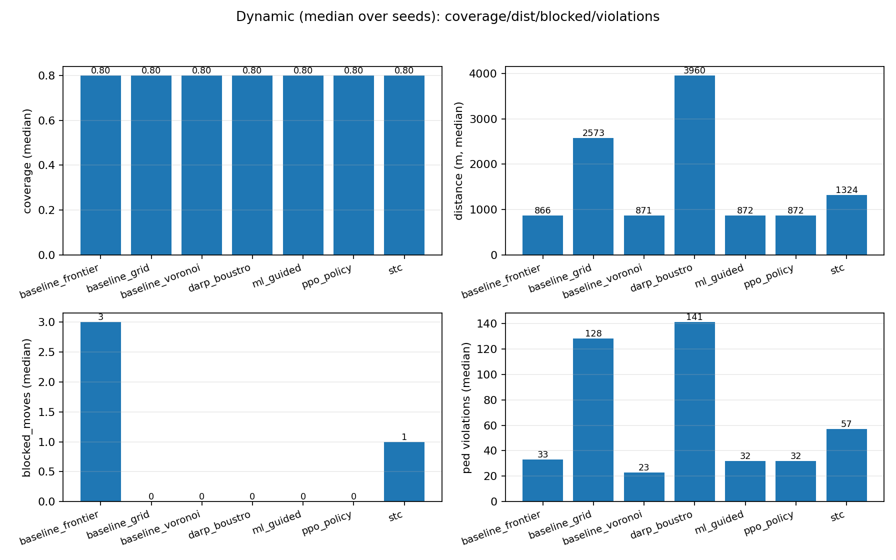
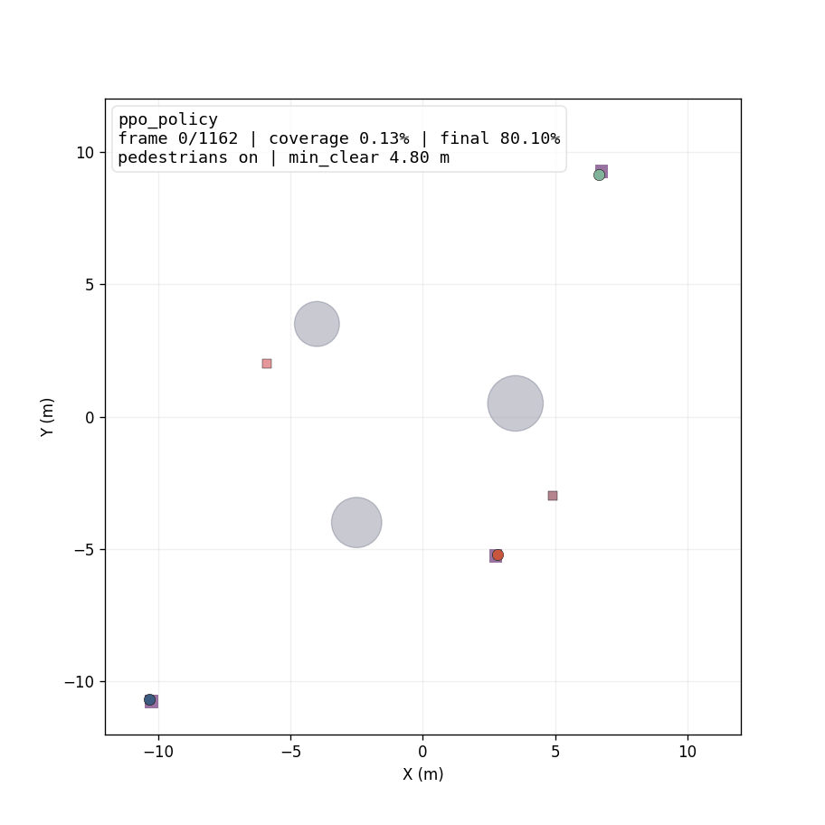

# Multi-Robot Coverage Research

Исследовательский репозиторий по **multi-robot coverage path planning**:
единая симуляционная постановка, reproducible batch-эксперименты и сравнение
классических, MAPF-, RL- и ML-guided подходов в статических и динамических сценах.

<p align="center">
  
</p>

<p align="center">
  <i>Curated public results: dynamic benchmark panel from the final report.</i>
</p>

## Quick Links

- [Main Results](#main-results)
- [Quick Start](#quick-start)
- [Reproduce Main Experiments](#reproduce-main-experiments)
- [Results Overview](docs/RESULTS_OVERVIEW.md)
- [Method Groups](docs/METHOD_GROUPS.md)
- [Experiments Overview](docs/EXPERIMENTS_OVERVIEW.md)
- [Publication Policy](docs/PUBLICATION_POLICY.md)

## Main Results

Ключевые публичные результаты лежат в `results/lab/presentation_report/`:

- [`report_cards.md`](results/lab/presentation_report/report_cards.md) — компактная таблица сравнения методов
- [`panel_median_static.png`](results/lab/presentation_report/panel_median_static.png) — медианы по static-сцене
- [`panel_median_dynamic.png`](results/lab/presentation_report/panel_median_dynamic.png) — медианы по dynamic-сцене
- [`panel_seed0_static_dynamic.png`](results/lab/presentation_report/panel_seed0_static_dynamic.png) — быстрый слайд для доклада
- [`GIF_INDEX.md`](results/lab/presentation_report/GIF_INDEX.md) — какие GIF открывать для демонстрации

По текущим итоговым public-таблицам:

- `baseline_frontier`, `baseline_voronoi`, `stc` — сильные classical baselines
- `ppo_policy` и `ml_guided` доведены до рабочего hybrid-режима для dynamic-сцены
- в dynamic-сцене основные методы доведены до `coverage >= 0.80`

### Demo visuals

**RL-guided policy**

<p>
  
</p>

## Research Core

### 1. Algorithms and simulation
- `coverage_lab/` — исследовательское ядро:
  - `algorithms/` — classical baselines, STC, DARP, MAPF wrappers
  - `rl/` — PPO env и policy
  - `ml_planner/` — ML-guided planner
  - `env/`, `sim.py`, `metrics.py` — общая среда и метрики

### 2. Experiment runners
- `experiments_lab/` — batch-конфиги и training scripts

### 2a. Legacy Isaac track
- `coverage_sim/` + `experiments/` — более ранняя Isaac Sim / legacy ветка проекта
- этот трек оставлен в репозитории для совместимости и дальнейшей доработки,
  но **не является основным путем воспроизведения главных research-результатов**

### 3. Public-facing results
- `results/lab/` — summary CSV, GIF/PNG, public comparison artifacts

### 4. Documentation
- [`docs/METHOD_GROUPS.md`](docs/METHOD_GROUPS.md) — карта групп методов
- [`docs/EXPERIMENTS_OVERVIEW.md`](docs/EXPERIMENTS_OVERVIEW.md) — какие batch-конфиги запускались и где смотреть результаты
- [`docs/RESULTS_OVERVIEW.md`](docs/RESULTS_OVERVIEW.md) — быстрый вход в ключевые таблицы, панели и GIF
- [`docs/PUBLICATION_POLICY.md`](docs/PUBLICATION_POLICY.md) — что входит в public core, а что не стоит публиковать

## Method Groups

В проекте отражены следующие группы методов:

1. Classical coverage methods
2. MAPF-oriented deconfliction
3. RL / learning through interaction
4. ML-guided planners
5. VLA — как future work / обзорный блок, без реализации

Детали: [`docs/METHOD_GROUPS.md`](docs/METHOD_GROUPS.md)

## Quick Start

```bash
python -m venv .venv
.venv\Scripts\activate
pip install -r requirements.txt
```

Для RL-пайплайна дополнительно нужны зависимости `stable-baselines3`, `gymnasium`, `torch`, если они еще не стоят в окружении.

## Reproduce Main Experiments

### Static comparison
```bash
python -m experiments_lab.run_batch --config experiments_lab/batch_presentation_static.yaml
```

### Dynamic comparison
```bash
python -m experiments_lab.run_batch --config experiments_lab/batch_presentation_dynamic.yaml
```

### Dynamic RL comparison
```bash
python experiments_lab/train_ppo.py --mode smoke --scene experiments_lab/scenes/dynamic_B_long.yaml
python -m experiments_lab.run_batch --config experiments_lab/batch_presentation_dynamic_rl.yaml
```

### Dynamic ML + RL comparison
```bash
python -m experiments_lab.run_batch --config experiments_lab/batch_presentation_dynamic_ml_rl.yaml
```

### Rebuild public report
```bash
python scripts/build_presentation_report.py --static results/lab/presentation_static/summary.csv --dynamic results/lab/presentation_dynamic_plus_rl_ml/summary.csv --seed 0
```

## Conference Demo / Main Results

Если вы хотите быстро понять проект как внешний читатель, откройте в таком порядке:

1. [`results/lab/presentation_report/report_cards.md`](results/lab/presentation_report/report_cards.md)
2. [`results/lab/presentation_report/panel_median_dynamic.png`](results/lab/presentation_report/panel_median_dynamic.png)
3. [`results/lab/presentation_report/GIF_INDEX.md`](results/lab/presentation_report/GIF_INDEX.md)
4. [`docs/RESULTS_OVERVIEW.md`](docs/RESULTS_OVERVIEW.md)

## Public Repository Notes

Если репозиторий используется как открытая исследовательская публикация, ориентироваться стоит так:

- `coverage_lab/` + `experiments_lab/` — основной research track
- `results/lab/presentation_report/` — curated public-facing results
- `coverage_sim/` + `experiments/` — legacy Isaac Sim track
- `agent/`, `panel/`, `viz/` — optional tools

Чеклист по тому, что публиковать и чего не должно быть в открытой версии:
- [`docs/PUBLICATION_POLICY.md`](docs/PUBLICATION_POLICY.md)

## Current Limitations

- VLA-блок в репозитории не реализован и используется только как обзорное направление.
- RL и ML-planner в текущей public-версии оформлены как practical/hybrid solutions для доклада, а не как окончательно завершенные SOTA-решения.
- Некоторые optional-подсистемы сохранены в репозитории как дополнительные направления развития и не являются обязательной частью основного сравнения.

## Optional Subsystems

Ниже перечислены дополнительные подсистемы, которые сохранены в репозитории, но не являются ядром public research demo:

### Isaac Sim integration
- [`docs/ISAAC_LIVE.md`](docs/ISAAC_LIVE.md)
- legacy `coverage_sim/` и `experiments/` для Isaac Sim и старых batch/live-сценариев
- этот блок сохранен как historical/optional branch проекта

### Publication notes
- что считать public core, legacy и что не публиковать:
  - [`docs/PUBLICATION_POLICY.md`](docs/PUBLICATION_POLICY.md)

### Survey / thesis support docs
- часть thesis/support материалов может храниться локально и не обязана входить в public-версию
- подробности: [`docs/PUBLICATION_POLICY.md`](docs/PUBLICATION_POLICY.md)

### Agent / panel utilities
- локальные agent- и panel-инструменты оставлены в репозитории как опциональные, но не являются обязательными для воспроизведения основных исследовательских результатов


