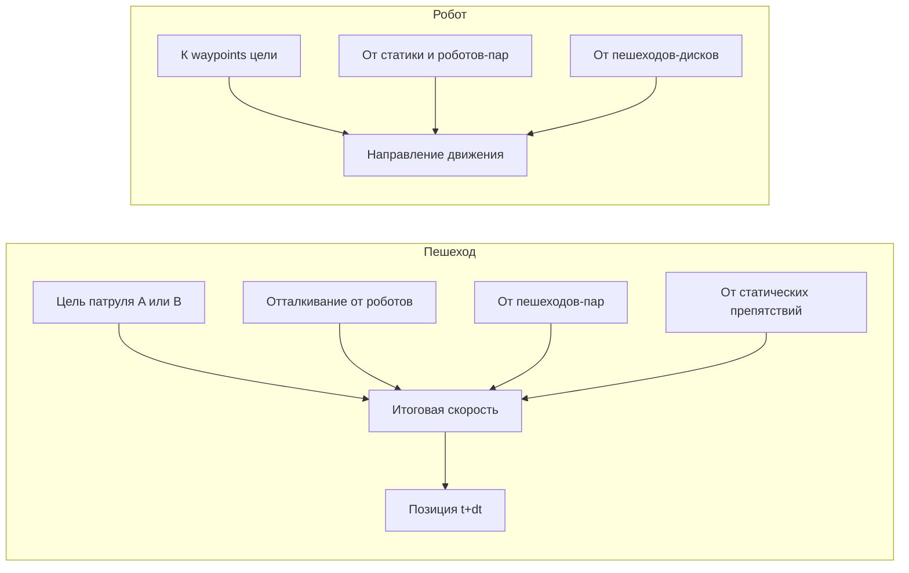

# Спецификация сцены «тротуар + кубы + пешеходы» под RL

Документ задаёт **одну согласованную постановку**: что крафтить в Isaac Sim, что фиксировать в конфигах, какие наблюдения/действия/награды использовать в RL, чтобы потом не переделывать цепочку «сцена → env → обучение → сравнение с эвристиками».

Ограничения проекта: без ROS2/Nav2/SLAM; планирование при **известной** геометрии статики и **заданных** законах движения пешеходов (см. `PROJECT_INIT.md`).

### Схема «умных» пешеходов (реализация в коде)

Пешеход стремится к концу патруля **A↔B** и получает силы отталкивания от роботов, других пешеходов и статических дисков (аналог потенциального поля). Роботы дополнительно **отталкиваются** от пешеходов в низкоуровневом движении. Включение: `pedestrians.enabled` в `coverage_sim/configs/world.yaml`.

---

## 1. Идея сцены (одно предложение)

Узкий **проходимый прямоугольник** (тротуар в плоскости X–Y), по бокам **статические кубы** как препятствия, по коридору движутся **2–3 пешехода** по заранее заданным периодическим траекториям (отрезок туда–обратно); **N роботов** должны **максимизировать покрытие** свободной области, **не нарушая** минимальную дистанцию до пешеходов и (опционально) друг другу.

---

## 2. Координаты и единицы

- Плоскость работы планировщика: **ось X и Y** (как сейчас в `IsaacEnvironment` и метриках).
- Высота Z / вращение робота — только для визуала в Sim; **политика оперирует 2D**.
- Единицы: **метры**; время дискретизации шага: `dt_sec` из `world.yaml` (сейчас 0.1 с).

**Рекомендуемый коридор (числа для примера — подставить после замера в Sim):**

| Параметр | Пример | Где задаётся |
|----------|--------|--------------|
| Проходимая область | `x ∈ [x_min, x_max]`, `y ∈ [y_min, y_max]` | `world.bounds_xy` |
| Разрешение сетки покрытия | 0.4–0.5 м | `coverage.grid_resolution_m` |

После крафта USD **обязательно** перенести в `bounds_xy` реальные границы **проходимой** площади (не весь мир Stage), иначе метрики покрытия и RL будут расходиться с визуалом.

---

## 3. Статика (Isaac Sim — ручной крафт)

| Объект | Роль | В 2D-модели |
|--------|------|-------------|
| Плита/пол | Тротуар | Внутри `bounds_xy` всё считается проходимым, кроме клеток/дисков препятствий |
| Кубы вдоль длинных сторон | Непроходимые препятствия | Диски `(cx, cy, r)` или список занятых клеток в YAML — **дублируют** сцену |
| Освещение, фон | Визуал | Не влияют на MDP |

**Имена в структуре сцены:** роботы — как в коде: `robot_0` … `robot_{N-1}` под родителем, ожидаемым в `isaac_env` (см. текущие live-скрипты).

**Артефакт:** один USD в репозитории (например `coverage_sim/assets/sidewalk_corridor.usd`) + запись в `world.scene_name`.

---

## 4. Динамика: пешеходы

**Упрощение для диплома:** не социальная симуляция, а **скриптовые агенты**.

- Каждый пешеход \(i\): отрезок от Aᵢ до Bᵢ в плоскости X–Y, движение с постоянной скоростью, **разворот** в концах (туда–обратно).
- В 2D для планировщика пешеход — **диск** радиуса \(r_p\) (например 0.35–0.45 м); центр в момент \(t\) известен из аналитики траектории.

**Представление в коде (цель для RL):**

- На шаге \(k\): массив `pedestrian_xy[k] = [(x,y,r), ...]` или только центры + общий \(r_p\).
- Синхронизация с USD: после каждого `step_simulation` обновлять трансформы примитивов пешеходов (если уже реализовано; иначе — следующий этап разработки).

---

## 5. Роботы

- Число: `robots.count` в `robots.yaml` (например 3).
- Радиус для коллизий/безопасности: согласовать с `IsaacEnvironment` (`_robot_radius_m`) и текстом ВКР.
- Управление: как сейчас — **целевая точка** на плоскости → низкоуровневый контроллер в env (без Nav2).

---

## 6. MDP для RL (согласованная постановка)

### 6.1 Наблюдение (рекомендуемый минимум)

Чтобы обучение было воспроизводимым и без камеры:

- Для робота \(j\): позиция \((x_j, y_j)\).
- Локальная **маска посещённости** или **бинарная сетка** в окне W×W вокруг робота (разрешение как в `grid_resolution_m`).
- Для каждого пешехода: **относительный вектор** \((\Delta x, \Delta y)\) и/или расстояние до ближайших K пешеходов.
- Опционально: позиции других роботов (для координации).

Всё это **детерминировано** из состояния симулятора при известной карте и законах пешеходов.

### 6.2 Действие

- **Вариант A (ближе к коду):** дискретное смещение следующей **целевой клетки** или waypoint на сетке внутри `bounds_xy` (как обёртка над текущим `set_robot_target`).
- **Вариант B:** небольшой непрерывный вектор смещения цели, квантование по сетке.

Главное — **одинаковый** интерфейс для классических алгоритмов и RL: «на шаг выдать цель в плоскости».

### 6.3 Награда (складка для покрытия + безопасность)

На шаг \(k\):

\[
R_k = \alpha \cdot \Delta\text{coverage}_k - \beta \cdot \mathbb{1}[d_{\min} < d_{\text{safe}}] - \gamma \cdot \text{time\_penalty}
\]

- \(\Delta\text{coverage}_k\) — прирост доли покрытия (как в метриках).
- \(d_{\min}\) — минимальная дистанция от любого робота до любого пешехода (поверхность дисков).
- Опционально: аналогичный штраф за сближение роботов.

**Критерии успеха в эксперименте:** те же, что у эвристик (`coverage`, время, `load_balance_cv`) **плюс** отчёт по `min pedestrian distance` и числу нарушений порога.

---

## 7. Слои реализации (порядок работ)

1. **Зафиксировать числа:** `bounds_xy`, список препятствий (YAML или извлечение из сцены), параметры пешеходов (отрезки A–B, скорость, \(r_p\)).
2. **Один источник истины:** на каждом шаге симуляции пешеходы и статика согласованы с тем, что видит «планировщик».
3. **Упрощённый тренировочный env** (сетка / без Isaac) с тем же **размером действия и смыслом награды**, что и целевой env.
4. **Интеграция в `run_experiment`:** алгоритм = ваша политика; экспорт `robot_paths` → `viz/playback.html` и Isaac live при необходимости.

---

## 8. Чеклист перед крафтом в Isaac

- [ ] Границы коридора замерены и перенесены в `bounds_xy`.
- [ ] Кубы не пересекают проходимую область «невидимой» частью — совпадение с 2D-дисками/клетками.
- [ ] Имена `robot_*` совпадают с кодом.
- [ ] USD сохранён, путь прописан в `world.yaml`.
- [ ] В ВКР: рисунок сцены + таблица координат препятствий и пешеходных отрезков.

---

## 9. Связь с текущим репозиторием

| Компонент | Файлы / модули |
|-----------|----------------|
| Умные пешеходы | `coverage_sim/env/smart_pedestrians.py`, `IsaacEnvironment.configure_pedestrians`, поля `pedestrian_paths` / `min_pedestrian_clearance_m` в JSON прогона |
| Обучение PPO (покрытие + пешеходы) | Блок `rl_training` в `world.yaml`, `coverage_sim/rl/coverage_ped_env.py`, `experiments/train_rl_coverage_ppo.py`, зависимости `requirements-rl.txt` |
| Границы, сцена, шаг | `coverage_sim/configs/world.yaml` |
| Число роботов | `coverage_sim/configs/robots.yaml` |
| Среда, препятствия, цели | `coverage_sim/env/isaac_env.py` |
| Метрики покрытия | `coverage_sim/metrics/coverage_metrics.py` |
| Прототип RL без Isaac | `coverage_sim/rl/grid_coverage_env.py` (расширять под пешеходов и те же награды) |
| Визуализация траекторий | `viz/playback.html` |
| Live в Sim | `run_live_isaac.bat`, `docs/ISAAC_LIVE.md` |

Эта спецификация — **контракт**: если сцена и конфиги ему соответствуют, RL и эвристики сравнимы по одним и тем же метрикам и одной геометрии.
